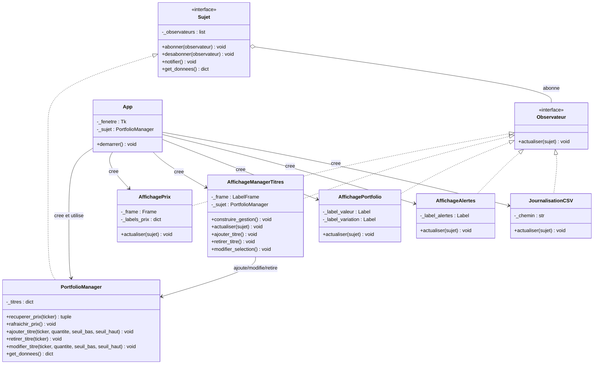

# UML du refactoring

Le sujet concret contient l'etat et les regles du portefeuille. Les observateurs
ne modifient jamais directement le portefeuille : ils lisent les donnees avec
`get_donnees()` et appellent les operations publiques du sujet pour transmettre
les actions de l'utilisateur.



## Responsabilites

### `Sujet`

Interface fournie. Elle gere la liste des observateurs, leur abonnement et la
notification. Elle ne connait pas les details de Tkinter.

### `PortfolioManager`

Sujet concret. Il est responsable de l'etat du portefeuille, de la recuperation
des prix, de l'ajout, du retrait et de la modification des titres. Il appelle
`notifier()` apres chaque changement important.

### Observateurs visuels

- `AffichagePrix` affiche le prix et la variation de chaque titre.
- `AffichageManagerTitres` construit le formulaire et delegue les actions au
  `PortfolioManager`.
- `AffichagePortfolio` affiche la valeur totale et sa variation.
- `AffichageAlertes` affiche les titres qui ont franchi un seuil.

### Observateur non visuel

`JournalisationCSV` enregistre les donnees recues dans `portfolio.csv`. Il
respecte la contrainte d'au moins un observateur non visuel.

### `App`

Point d'assemblage de l'application. Elle cree la fenetre, le sujet et les
observateurs, puis abonne chaque observateur au `PortfolioManager`. Elle ne
calcule pas les prix et ne modifie pas directement `_titres`.

## Flux d'une mise a jour

```text
App -> PortfolioManager.rafraichir_prix()
PortfolioManager -> yfinance : recuperer les prix
PortfolioManager -> notifier()
notifier() -> AffichagePrix.actualiser()
notifier() -> AffichagePortfolio.actualiser()
notifier() -> AffichageAlertes.actualiser()
notifier() -> JournalisationCSV.actualiser()
```